# Лабораторная работа №2. Облачные вычислительные сервисы. Amazon EC2

## Часть 1

### Задание 1
1. Войдите в консоль AWS и в правом верхнем углу выберите регион Europe (Frankfurt). 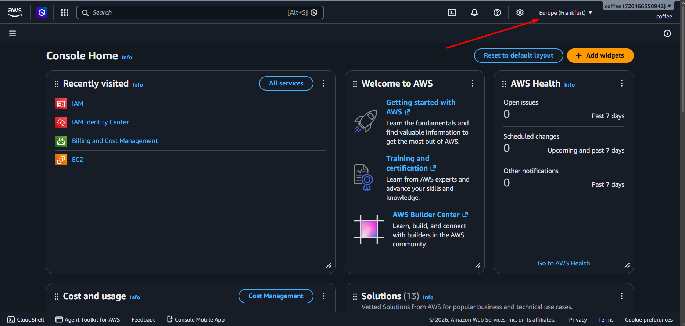

2. Создаю пользователя **IAM**
    1. Откройте **IAM** → **User groups** → **Create group**, назовите группу **Admins** и подключите к ней политику **AdministratorAccess**.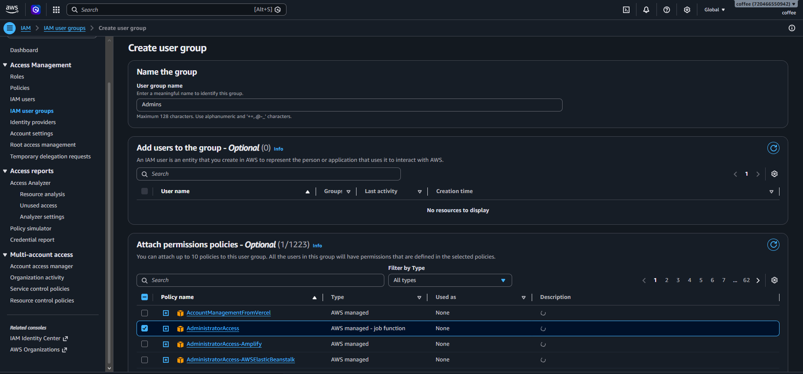
    2. Откройте **Users** → **Create user**, задайте имя (например, **cloudstudent**), включите доступ к консоли (**Provide user access to the AWS Management Console**) и добавьте пользователя в группу **Admins**.
    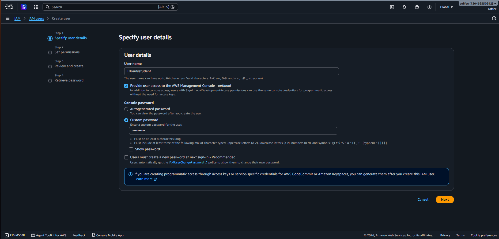
    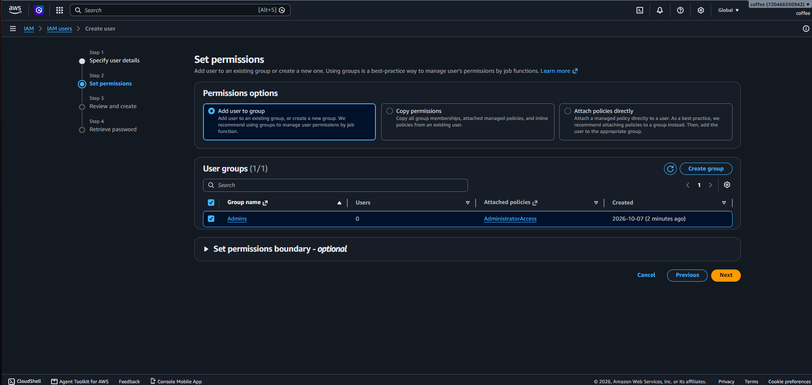
    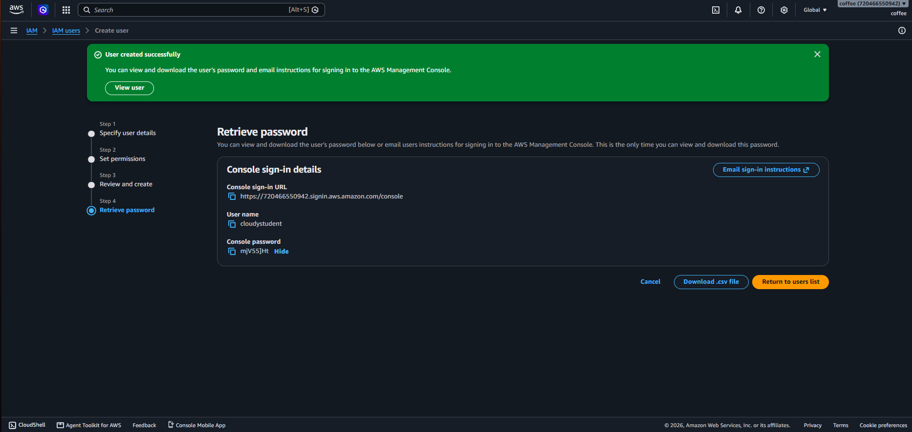
    Имя пользователя: cloudystudent
    Пароль пользователя: mjV55]Ht
    3. Выйдите из консоли и войдите снова, уже под этим пользователем.
    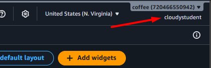

3. Настройте бюджет с нулевым порогом, чтобы получить письмо, как только аккаунт начнёт тратить деньги:
    1. Откройте Billing and Cost Management → Budgets → Create budget. 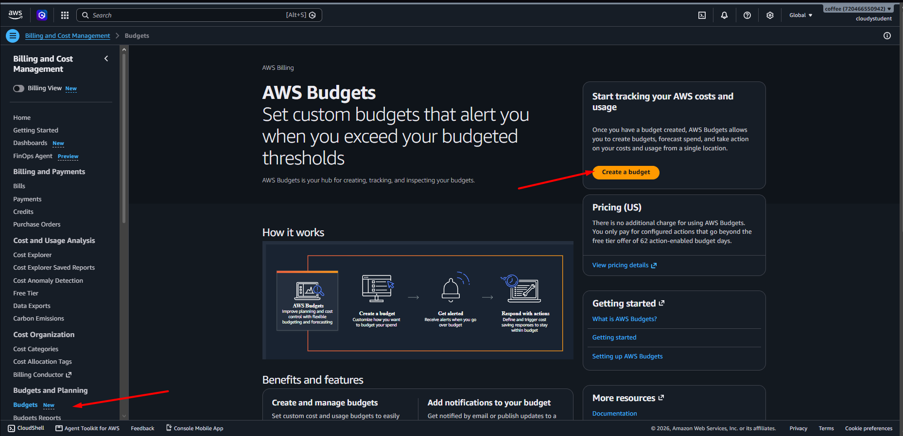
    2. Выберите шаблон Zero spend budget.
    3. Укажите имя ZeroSpend и свой email.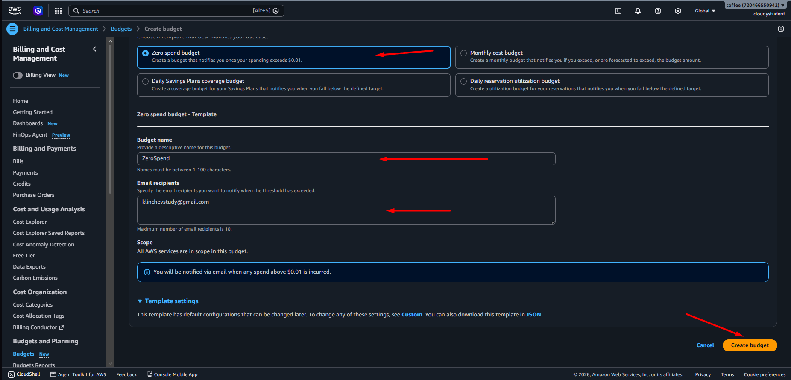
    4. Нажмите Create budget.
    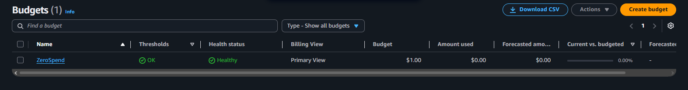

### Задание 2. Запуск экземпляра EC2

1. Откройте EC2 → Instances → Launch instances.

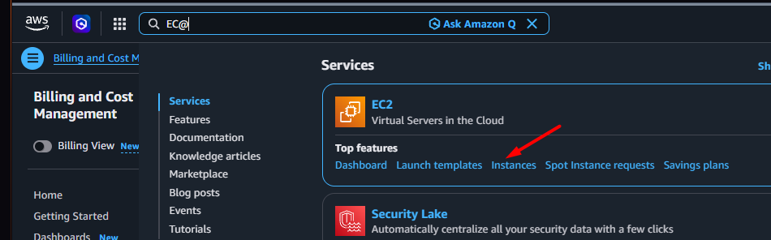

2. Заполните параметры

    1. Name: webserver.
    2. AMI: Amazon Linux 2023.
    3. Instance type: t3.micro.
    4. Key pair: Create new key pair, имя yournickname-keypair, тип ED25519, формат .pem. Файл скачается автоматически, второй раз скачать его нельзя. Переложите его в папку .ssh в домашней папке.
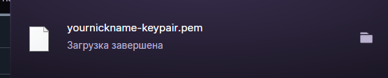
    5. Network settings: оставьте default VPC и включённый публичный IP. Создайте новую Security Group с именем webserver-sg и двумя правилами для входящего трафика:
        - SSH с источником My IP;
        - HTTP с источником Anywhere (0.0.0.0/0).

    6. Configure storage: оставьте значения по умолчанию.
    7. Advanced details → User data: вставьте скрипт:

> #!/bin/bash
> dnf -y update
> dnf -y install htop nginx
> systemctl enable --now nginx

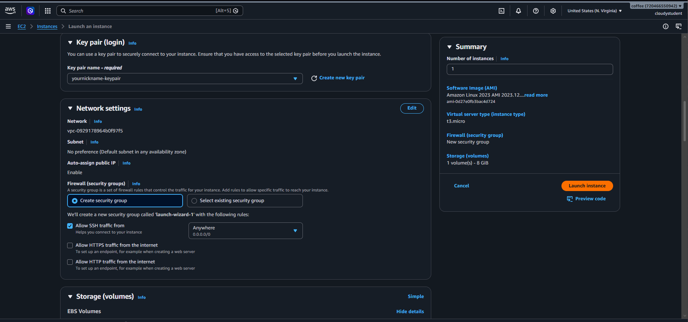

3. Нажмите Launch instance. Дождитесь состояния Running и прохождения всех проверок в колонке Status check.

4. Откройте в браузере http://<Public-IP>, где <Public-IP> - публичный IP-адрес экземпляра. Вы должны увидеть приветственную страницу nginx.
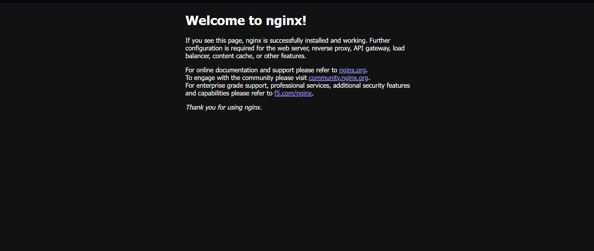

### Задание 3. Мониторинг и диагностика

1. Status checks. Откройте экземпляр и вкладку Status and alarms. EC2 постоянно проверяет экземпляр:

- System status check проверяет инфраструктуру AWS: физический сервер и сеть, на которых работает экземпляр;
- Instance status check проверяет саму виртуальную машину: загрузилась ли операционная система и отвечает ли она;
- Attached EBS status check проверяет, доступны ли подключённые тома EBS.
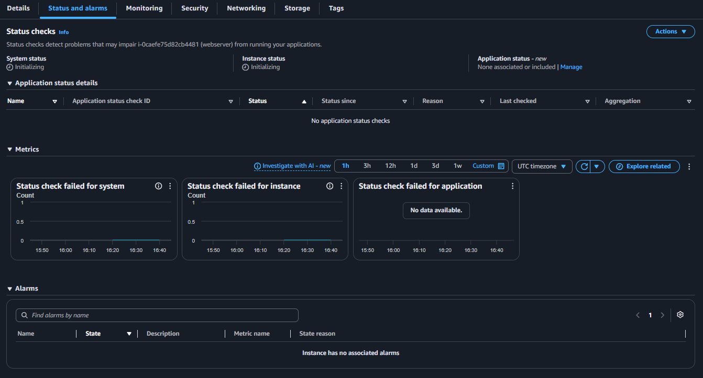

2. Monitoring. Откройте вкладку Monitoring. Здесь показаны метрики Amazon CloudWatch: загрузка процессора, сетевой трафик, операции с диском. По умолчанию включён базовый мониторинг, метрики приходят раз в 5 минут. Детальный мониторинг (Detailed monitoring) присылает их раз в минуту и оплачивается отдельно.
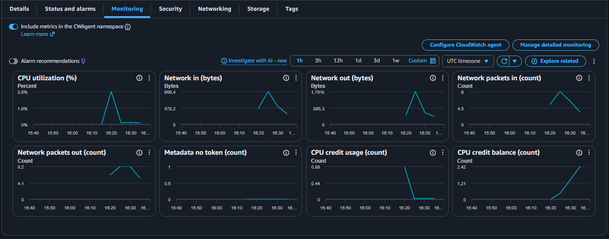

3. System log. Выберите Actions → Monitor and troubleshoot → Get system log. Это вывод консоли экземпляра, как если бы к серверу был подключён монитор. Найдите строки, в которых устанавливается nginx из вашего скрипта User data. Если лог пуст, подождите пару минут.

```cmd
[   34.612619] cloud-init[1870]: Installing:
[   34.612830] cloud-init[1870]:  htop                  x86_64   3.2.1-87.amzn2023.0.3       amazonlinux   183 k
[   34.613038] cloud-init[1870]:  nginx                 x86_64   1:1.30.5-1.amzn2023.0.1     amazonlinux    34 k
```

4. Instance screenshot. Выберите Actions → Monitor and troubleshoot → Get instance screenshot. Снимок экрана помогает, когда подключиться по SSH не удаётся: по нему видно, загрузилась ли система вообще.
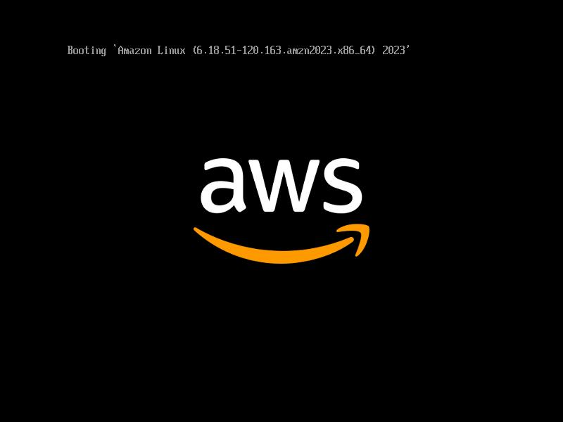

### Задание 4. Подключение по SSH

Откройте терминал на своём компьютере.
Подключитесь к экземпляру:
```cmd
PS D:\USM\III-st year\Cloud Computing\lab 2> ssh -i $HOME\.ssh\yournickname-keypair.pem ec2-user@52.202.139.108
The authenticity of host '52.202.139.108 (52.202.139.108)' can't be established.
ECDSA key fingerprint is SHA256:BlpJHHBSR6ZtMpQ0hq2gJt9LMHZtTLfJWgyhoH3w7oY.
Are you sure you want to continue connecting (yes/no/[fingerprint])? yes
Warning: Permanently added '52.202.139.108' (ECDSA) to the list of known hosts.
   ,     #_
   ~\_  ####_        Amazon Linux 2023
  ~~  \_#####\
  ~~     \###|
  ~~       \#/ ___   https://aws.amazon.com/linux/amazon-linux-2023
   ~~       V~' '->
    ~~~         /
      ~~._.   _/
         _/ _/
       _/m/'
[ec2-user@ip-172-31-40-33 ~]$
```

5. Проверьте, что nginx работает:

```cmd
[ec2-user@ip-172-31-40-33 ~]$ systemctl status nginx
● nginx.service - The nginx HTTP and reverse proxy server
     Loaded: loaded (/usr/lib/systemd/system/nginx.service; enabled; preset: disabled)
     Active: active (running) since Wed 2026-10-07 16:19:26 UTC; 1h 2min ago
    Process: 3945 ExecStartPre=/usr/bin/rm -f /run/nginx.pid (code=exited, status=0/SUCCESS)
    Process: 3989 ExecStartPre=/usr/sbin/nginx -t (code=exited, status=0/SUCCESS)
    Process: 4028 ExecStart=/usr/sbin/nginx (code=exited, status=0/SUCCESS)
   Main PID: 4055 (nginx)
      Tasks: 3 (limit: 1059)
     Memory: 3.5M
        CPU: 80ms
     CGroup: /system.slice/nginx.service
             ├─4055 "nginx: master process /usr/sbin/nginx"
             ├─4056 "nginx: worker process"
             └─4057 "nginx: worker process"

Oct 07 16:19:26 ip-172-31-40-33.ec2.internal systemd[1]: Starting nginx.service - The nginx HTTP and reverse proxy serv>
Oct 07 16:19:26 ip-172-31-40-33.ec2.internal nginx[3989]: nginx: the configuration file /etc/nginx/nginx.conf syntax is>
Oct 07 16:19:26 ip-172-31-40-33.ec2.internal nginx[3989]: nginx: configuration file /etc/nginx/nginx.conf test is succe>
Oct 07 16:19:26 ip-172-31-40-33.ec2.internal systemd[1]: Started nginx.service - The nginx HTTP and reverse proxy serve>
```

### Задание 5. Статический сайт

1. Создайте на своём компьютере три HTML-файла: index.html (главная страница), about.html ("О нас") и contact.html ("Контакты"). Страницы должны ссылаться друг на друга.
2. Скопируйте их на сервер командой scp. Её нужно выполнять в терминале на своём компьютере, а не на сервере:

```cmd 
C:\Users\Coffevarin> scp -i ~/.ssh/yournickname-keypair.pem "D:\USM\III-st year\Cloud Computing\lab 2\site\about.html" "D:\USM\III-st year\Cloud Computing\lab 2\site\contact.html" "D:\USM\III-st year\Cloud Computing\lab 2\site\index.html" ec2-user@52.202.139.108:~
about.html                                                                            100% 6273    50.1KB/s   00:00
contact.html                                                                          100% 4574    35.5KB/s   00:00
index.html                                                                            100% 7889    62.1KB/s   00:00

C:\Users\Coffevarin>
```

3. Подключитесь к серверу по SSH и переложите файлы в папку, из которой nginx отдаёт страницы:
```cmd
[ec2-user@ip-172-31-40-33 ~]$ sudo cp ~/*.html /usr/share/nginx/html/
/usr/share/nginx/htmlls -l /usr/share/nginx/html
```


```cmd
$ aws ec2 stop-instances --instance-ids i-0caefe75d82cb4481 --region us-east-1
{
    "StoppingInstances": [
        {
            "InstanceId": "i-0caefe75d82cb4481",
            "CurrentState": {
                "Code": 64,
                "Name": "stopping"
            },
            "PreviousState": {
                "Code": 16,
                "Name": "running"
            }
        }
    ]
}
```


### Задание 6. Остановка экземпляра через AWS CLI

Остановите экземпляр командой AWS CLI. Выполнить её можно двумя способами:

на своём компьютере, если вы настроили AWS CLI с ключами своего пользователя IAM (лекция 3);
в AWS CloudShell: это терминал прямо в консоли AWS, значок >_ в верхней панели. В CloudShell AWS CLI уже установлен и работает от имени пользователя, под которым вы вошли в консоль, поэтому ключи настраивать не нужно.
aws ec2 stop-instances --instance-ids <ID-экземпляра> --region eu-central-1
Идентификатор экземпляра имеет вид i-0... и виден в списке Instances.

## Часть 2 Продвинутый уровень

### Задание 3