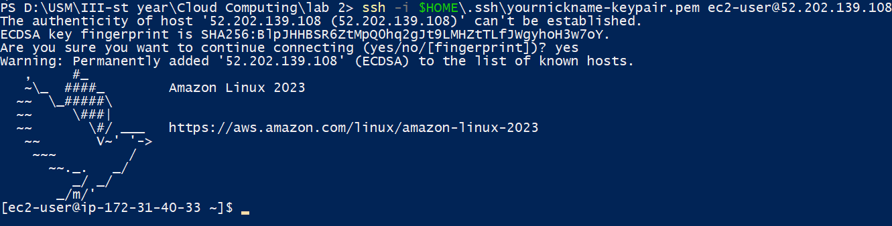
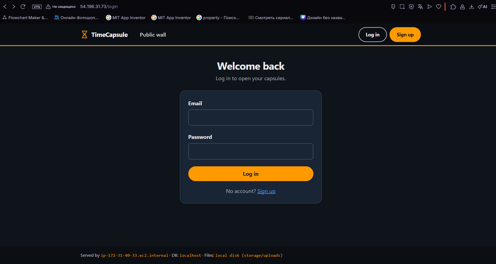
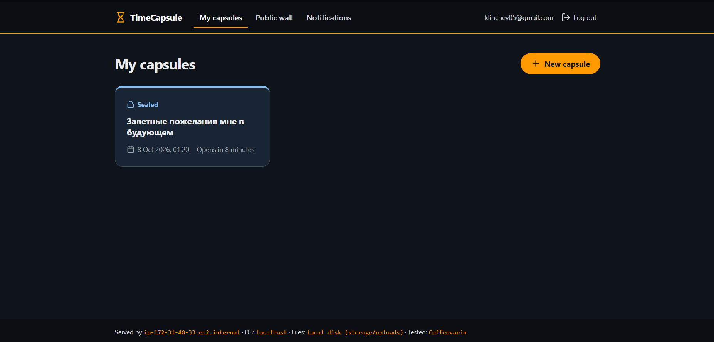
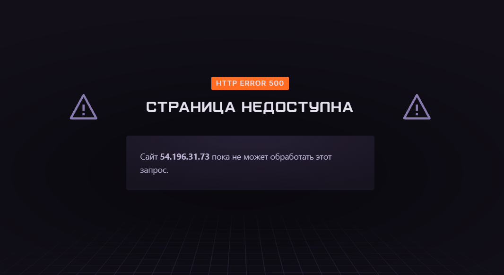
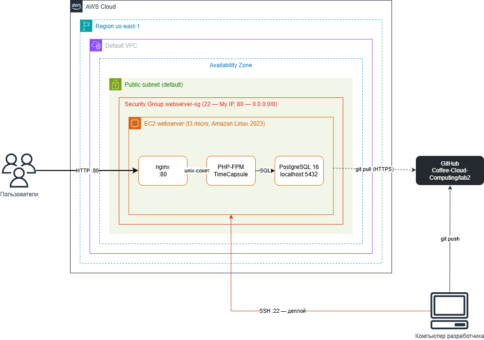

# Лабораторная работа №2. Облачные вычислительные сервисы. Amazon EC2

| | |
| --- | --- |
| **Студент** | Klincev Andrei  |
| **Группа** | IA2403 |
| **Специальность** | Informatică aplicată |
| **Уровень** | Продвинутый (Часть 1 и Часть 2) |
| **Приложение** | TimeCapsule, `open_capsules_php_functional` (PHP без фреймворка) |
| **Вариант деплоя** | A — вручную на сервере (`git pull` + команды) |
| **Репозиторий** | <https://github.com/Coffee-Cloud-Computing/lab2> |
| **Экземпляр** | `webserver`, `i-0caefe75d82cb4481`, регион `us-east-1` |

## Цель работы

Научиться запускать и настраивать виртуальные машины Amazon EC2, подключаться к ним по SSH, диагностировать их состояние и разворачивать на них веб-приложение: от статической страницы до приложения с базой данных, которое сервер сам забирает из репозитория GitHub.

---

## Часть 1. Базовый уровень

### Задание 1. Подготовка аккаунта


_Выбор региона в правом верхнем углу консоли AWS._


_Создание группы `Admins` и подключение политики `AdministratorAccess`._


_Создание пользователя IAM `cloudystudent` с доступом к консоли._


_Добавление пользователя в группу `Admins`._


_Пользователь создан. Пароль на скриншоте и в отчёте не приводится._


_Вход в консоль под пользователем IAM, а не под root._


_Раздел `Budgets` в `Billing and Cost Management`._


_Шаблон `Zero spend budget`, имя `ZeroSpend` и email для уведомлений._


_Бюджет `ZeroSpend` в списке `Budgets`._

**Что разрешает политика `AdministratorAccess`? Почему для повседневной работы нельзя использовать root?**
`AdministratorAccess` разрешает любые действия (`"Action": "*"`) над любыми ресурсами (`"Resource": "*"`) во всех сервисах AWS. Root нельзя ограничить политиками IAM: он может закрыть аккаунт, изменить платёжные данные и удалить что угодно. Если его пароль утечёт, аккаунт будет потерян полностью. Пользователя IAM можно ограничить, отключить или удалить, а его действия видны в журналах под отдельным именем.

### Задание 2. Запуск экземпляра EC2


_Запуск мастера `Launch instances`._


_Создание пары ключей `yournickname-keypair`, тип ED25519, формат `.pem`._

Параметры экземпляра: _Name_ `webserver`, _AMI_ Amazon Linux 2023, _Instance type_ `t3.micro`, Security Group `webserver-sg` (SSH — My IP, HTTP — `0.0.0.0/0`), хранилище по умолчанию. В _User data_ указан скрипт:

```bash
#!/bin/bash
dnf -y update
dnf -y install htop nginx
systemctl enable --now nginx
```


_Экземпляр `webserver` в состоянии `Running`, все проверки пройдены._


_Приветственная страница nginx по публичному IP-адресу экземпляра._

**Что такое User data и когда выполняется этот скрипт? Выполнится ли он повторно после перезагрузки?**
User data — это скрипт или данные, которые передаются экземпляру при запуске. Агент cloud-init выполняет скрипт от имени root один раз, при первой загрузке экземпляра. После перезагрузки или остановки с запуском он повторно не выполняется (если специально не настроить cloud-init иначе).

### Задание 3. Мониторинг и диагностика


_Вкладка `Status and alarms`: System, Instance и Attached EBS status checks пройдены._


_Вкладка `Monitoring` с метриками CloudWatch: CPU, сеть, диск._

Фрагмент `System log` с установкой nginx из скрипта User data:

```text
[   34.612619] cloud-init[1870]: Installing:
[   34.612830] cloud-init[1870]:  htop     x86_64   3.2.1-87.amzn2023.0.3     amazonlinux   183 k
[   34.613038] cloud-init[1870]:  nginx    x86_64   1:1.30.5-1.amzn2023.0.1   amazonlinux    34 k
```


_`Get instance screenshot`: система загрузилась и показывает приглашение входа._

**Какая из проверок укажет на проблему, которую можете исправить вы, а какая — на проблему на стороне AWS?**
_System status check_ проверяет физический сервер и сеть AWS. Если она не проходит, проблема у AWS: помогает остановить и снова запустить экземпляр, чтобы он переехал на другой хост. _Instance status check_ проверяет саму ОС: ошибки в конфигурации, заполненный диск, неверный fstab. Такие проблемы исправляет владелец экземпляра.

**В каких случаях стоит включать детальный мониторинг?**
Когда важны кратковременные пики нагрузки, которые теряются в 5-минутном усреднении. Например, для production-серверов, для Auto Scaling, который должен реагировать быстрее, и при поиске причин сбоев. Для учебного сервера хватает базового мониторинга, за детальный нужно платить.

### Задание 4. Подключение по SSH



_Успешное подключение по SSH к экземпляру `52.202.139.108` из PowerShell._

```text
[ec2-user@ip-172-31-40-33 ~]$ systemctl status nginx
● nginx.service - The nginx HTTP and reverse proxy server
     Loaded: loaded (/usr/lib/systemd/system/nginx.service; enabled; preset: disabled)
     Active: active (running) since Wed 2026-10-07 16:19:26 UTC; 1h 2min ago
   Main PID: 4055 (nginx)
     CGroup: /system.slice/nginx.service
             ├─4055 "nginx: master process /usr/sbin/nginx"
             ├─4056 "nginx: worker process"
             └─4057 "nginx: worker process"
```

_Вывод `systemctl status nginx`: сервис включён и работает._

**Почему для входа на экземпляр EC2 используется ключ, а не пароль?**
Пароль можно подобрать перебором, а сервер с открытым портом 22 атакуют постоянно. Приватный ключ невозможно угадать, и он никогда не передаётся по сети: сервер проверяет подпись с помощью публичного ключа. Кроме того, AWS не нужно хранить или передавать пароль: публичный ключ просто записывается в `~/.ssh/authorized_keys` при запуске.

### Задание 5. Статический сайт

Создан сайт кофейни «Зерно & Пар» из трёх страниц: `index.html`, `about.html`, `contact.html` (папка [`site/`](site/)). Копирование на сервер (на своём компьютере):

```text
C:\Users\Coffevarin> scp -i ~/.ssh/yournickname-keypair.pem site\about.html site\contact.html site\index.html ec2-user@52.202.139.108:~
about.html          100% 6273    50.1KB/s   00:00
contact.html        100% 4574    35.5KB/s   00:00
index.html          100% 7889    62.1KB/s   00:00
```

Перенос файлов в папку nginx (на сервере):

```text
[ec2-user@ip-172-31-40-33 ~]$ sudo cp ~/*.html /usr/share/nginx/html/
[ec2-user@ip-172-31-40-33 ~]$ ls -l /usr/share/nginx/html
```

_Сайт «Зерно & Пар» открывается по публичному IP, ссылки между страницами работают._

**Что делает команда `scp` и чем она похожа на `ssh`?**
`scp` (secure copy) копирует файлы между компьютерами по защищённому каналу. Она работает поверх протокола SSH: использует тот же порт 22, тот же ключ (`-i`), того же пользователя и тот же адрес сервера. Отличие в том, что `ssh` открывает терминал на сервере, а `scp` только передаёт файлы.

### Задание 6. Остановка экземпляра через AWS CLI

```text
$ aws ec2 stop-instances --instance-ids i-0caefe75d82cb4481 --region us-east-1
{
    "StoppingInstances": [
        {
            "InstanceId": "i-0caefe75d82cb4481",
            "CurrentState": { "Code": 64, "Name": "stopping" },
            "PreviousState": { "Code": 16, "Name": "running" }
        }
    ]
}
```

_Экземпляр переходит из состояния `running` в `stopping`._

**Чем `Stop` отличается от `Terminate`? За что вы продолжаете платить, пока экземпляр остановлен?**
`Stop` выключает экземпляр, но сохраняет его вместе с корневым томом EBS: позже его можно запустить снова, но публичный IP сменится. `Terminate` удаляет экземпляр окончательно, а корневой том по умолчанию удаляется вместе с ним. За остановленный экземпляр не платят за вычисления, но продолжают платить за тома EBS, снимки и закреплённые Elastic IP.

---

## Часть 2. Продвинутый уровень

### Задание 7. Организация и репозиторий на GitHub

Создана организация `Coffee-Cloud-Computing` и публичный репозиторий [`lab2`](https://github.com/Coffee-Cloud-Computing/lab2), в который загружен код приложения `open_capsules_php_functional`.


**Почему папка `vendor/` и файл `.env` не попали в репозиторий?**
Они перечислены в `.gitignore` (`/vendor/` и `/.env`). `vendor/` — это сторонние библиотеки, их можно в любой момент восстановить командой `composer install` по `composer.lock`, хранить их в git бессмысленно. `.env` содержит пароли и настройки конкретного сервера, поэтому в публичный репозиторий он попасть не должен.

### Задание 8. Подготовка сервера

После запуска экземпляра публичный IP сменился на `54.196.31.73`.

```text
[ec2-user@ip-172-31-40-33 ~]$ sudo dnf -y install git composer postgresql16-server \
>    php8.4-fpm php8.4-cli php8.4-pgsql php8.4-mbstring php8.4-xml
...
Installed:
  composer-2.10.3   git-2.50.1   php8.4-cli-8.4.25   php8.4-fpm-8.4.25
  php8.4-mbstring-8.4.25   php8.4-pgsql-8.4.25   php8.4-xml-8.4.25
  postgresql16-server-16.15   ...
Complete!

[ec2-user@ip-172-31-40-33 ~]$ php -v
PHP 8.4.25 (cli) (built: Aug 25 2026 18:15:03) (NTS gcc x86_64)
[ec2-user@ip-172-31-40-33 ~]$ php -m | grep pdo_pgsql
pdo_pgsql
```

_Пакеты установлены, PHP 8.4 видит драйвер PostgreSQL `pdo_pgsql`._

**Почему мы устанавливаем эти пакеты вручную, а не добавляем их в User data?**
User data выполняется только при первом запуске экземпляра, а наш `webserver` уже был запущен в Части 1, поэтому изменённый скрипт не выполнится. Кроме того, при ручной установке сразу видны ошибки, а ошибку в User data пришлось бы искать в `System log`.

### Задание 9. База данных PostgreSQL

```text
[ec2-user@ip-172-31-40-33 ~]$ sudo postgresql-setup --initdb
* Initializing database in '/var/lib/pgsql/data'
[ec2-user@ip-172-31-40-33 ~]$ sudo grep -v '^#' /var/lib/pgsql/data/pg_hba.conf | grep -v '^$'
local   all             all                                     peer
host    all             all             127.0.0.1/32            ident
host    all             all             ::1/128                 ident
...
[ec2-user@ip-172-31-40-33 ~]$ sudo sed -i 's/ident$/scram-sha-256/' /var/lib/pgsql/data/pg_hba.conf
[ec2-user@ip-172-31-40-33 ~]$ sudo systemctl enable --now postgresql
[ec2-user@ip-172-31-40-33 ~]$ sudo -u postgres psql -c "CREATE USER timecapsule WITH PASSWORD '********';"
CREATE ROLE
[ec2-user@ip-172-31-40-33 ~]$ sudo -u postgres psql -c "CREATE DATABASE timecapsule OWNER timecapsule;"
CREATE DATABASE
```

```text
[ec2-user@ip-172-31-40-33 ~]$ psql -h localhost -U timecapsule -d timecapsule -c "SELECT 1;"
Password for user timecapsule:
 ?column?
----------
        1
(1 row)
```

_Подключение к базе `timecapsule` по паролю работает._

### Задание 10. Развёртывание кода приложения на сервере

```text
[ec2-user@ip-172-31-40-33 ~]$ sudo mkdir -p /var/www/timecapsule
[ec2-user@ip-172-31-40-33 ~]$ sudo chown ec2-user:ec2-user /var/www/timecapsule
[ec2-user@ip-172-31-40-33 ~]$ git clone https://github.com/Coffee-Cloud-Computing/lab2.git /var/www/timecapsule
Cloning into '/var/www/timecapsule'...
Receiving objects: 100% (95/95), 1.75 MiB | 42.70 MiB/s, done.
[ec2-user@ip-172-31-40-33 timecapsule]$ ls
Dockerfile  README.md  bin  composer.json  composer.lock  database  deploy  docker  docker-compose.yml  public  src  storage  views
```

_Код приложения скачан с GitHub в `/var/www/timecapsule`._

Создан файл `.env` (`nano /var/www/timecapsule/.env`) по образцу из задания. Его содержимое в отчёт не включено, так как в нём пароль к базе данных. Затем настроены права:

```text
[ec2-user@ip-172-31-40-33 timecapsule]$ chmod 640 .env
[ec2-user@ip-172-31-40-33 timecapsule]$ sudo chgrp apache .env
[ec2-user@ip-172-31-40-33 timecapsule]$ sudo chown -R apache:apache storage
```

```text
[ec2-user@ip-172-31-40-33 timecapsule]$ composer install --no-dev --optimize-autoloader
Installing dependencies from lock file
Package operations: 6 installs, 0 updates, 0 removals
  - Installing vlucas/phpdotenv (v5.7.0): Extracting archive
  ...
Generating optimized autoload files
[ec2-user@ip-172-31-40-33 timecapsule]$ php bin/init-db.php
Could not initialise the database: SQLSTATE[08006] [7] ... FATAL:  password authentication failed for user "timecapsule"
[ec2-user@ip-172-31-40-33 timecapsule]$ nano /var/www/timecapsule/.env
[ec2-user@ip-172-31-40-33 timecapsule]$ php bin/init-db.php
Database is ready (localhost).
```

_Библиотеки установлены, таблицы созданы. Первая попытка не удалась, потому что в `.env` остался пароль-заглушка `ваш-пароль`; после исправления база готова._

**Почему пароль к базе данных хранится в файле `.env` на сервере, а не в коде в репозитории? Почему публичный репозиторий безопасен для этого приложения?**
Репозиторий публичный, и всё, что в него попадает, видят все, причём навсегда остаётся в истории коммитов. Пароль относится к конкретному серверу, а не к коду, поэтому он хранится только на сервере в `.env`, который исключён `.gitignore`. Публичный репозиторий безопасен, потому что в нём только код без секретов, а база данных слушает только `localhost` и из интернета недоступна, даже если знать её имя и пользователя.

### Задание 11. Настройка PHP-FPM и nginx

```text
sudo sed -i 's/^upload_max_filesize.*/upload_max_filesize = 6M/' /etc/php.ini
sudo nano /etc/nginx/conf.d/timecapsule.conf
```

В `/etc/nginx/conf.d/timecapsule.conf` записана конфигурация сайта из задания: `root /var/www/timecapsule/public`, front controller через `try_files $uri /index.php?$query_string`, передача `.php` в PHP-FPM через сокет `unix:/run/php-fpm/www.sock` и запрет доступа к скрытым файлам (`.env`, `.git`).

```text
[ec2-user@ip-172-31-40-33 timecapsule]$ sudo nginx -t
nginx: the configuration file /etc/nginx/nginx.conf syntax is ok
nginx: configuration file /etc/nginx/nginx.conf test is successful
[ec2-user@ip-172-31-40-33 timecapsule]$ sudo systemctl enable --now php-fpm
Created symlink /etc/systemd/system/multi-user.target.wants/php-fpm.service → /usr/lib/systemd/system/php-fpm.service.
[ec2-user@ip-172-31-40-33 timecapsule]$ sudo systemctl restart nginx
```

_Конфигурация nginx без ошибок, PHP-FPM запущен._



_Страница входа TimeCapsule по адресу `http://54.196.31.73`._

Ответ `http://54.196.31.73/health`:

```json
{"status":"ok","db":"ok","hostname":"ip-172-31-40-33.ec2.internal"}
```

_Приложение работает и видит базу данных._

### Задание 12. Обновление приложения (вариант A)

```text
[ec2-user@ip-172-31-40-33 ~]$ cd /var/www/timecapsule
[ec2-user@ip-172-31-40-33 timecapsule]$ git pull
Already up to date.
[ec2-user@ip-172-31-40-33 timecapsule]$ composer install --no-dev --optimize-autoloader
Nothing to install, update or remove
[ec2-user@ip-172-31-40-33 timecapsule]$ php bin/init-db.php
Database is ready (localhost).
[ec2-user@ip-172-31-40-33 timecapsule]$ sudo systemctl reload php-fpm
```

_Ручной выпуск новой версии: новых коммитов пока нет._

**`git pull` заменяет файлы по одному. Что может увидеть посетитель в этот момент? Что случится, если после `git pull` не выполнится `composer install`?**
В течение нескольких секунд часть файлов уже новая, а часть ещё старая, поэтому посетитель может получить ошибку 500 или страницу, собранную из разных версий кода. Если новая версия требует новую библиотеку, а `composer install` не выполнился, в `vendor/` её не будет, и все страницы, которые её используют, будут падать с ошибкой «class not found».

### Задание 13. Новая версия, поломка и откат

1. Зарегистрирован пользователь и создана капсула с прикреплённым файлом: приложение работает.

2. В подвал (`views/layout.php`) добавлено имя автора `Coffeevarin`. Отправка изменения в репозиторий:

   ```text
   PS D:\USM\III-st year\Cloud Computing\lab 2> git commit -m "Show author in footer"
   [main fc08a12] Show author in footer
    1 file changed, 1 insertion(+), 1 deletion(-)
   PS D:\USM\III-st year\Cloud Computing\lab 2> git push
   To https://github.com/Coffee-Cloud-Computing/lab2.git
      f62a6c7..fc08a12  main -> main
   ```

   После деплоя по варианту A:

   

   _В подвале страницы появилось `Tested: Coffeevarin`, капсула с файлом сохранилась._

3. В конец `views/layout.php` добавлена строка `<?php broken(` (коммит `8452c62 Ops! Site is broken`) и выполнен деплой:

   

   _Главная страница отвечает ошибкой 500._

   При этом `/health` продолжает отвечать:

   ```json
   {"status":"ok","db":"ok","hostname":"ip-172-31-40-33.ec2.internal"}
   ```

4. Откат через репозиторий (коммит `daa6c83 Revert "Ops! Site is broken"`) и повторный деплой:

   ```text
   PS D:\USM\III-st year\Cloud Computing\lab 2> git revert --no-edit HEAD
   PS D:\USM\III-st year\Cloud Computing\lab 2> git push
   ```


   

   _После `git revert` и повторного деплоя сайт снова работает._

**Почему `/health` отвечает `ok`, хотя главная страница не работает? Что проверяет этот адрес? Чего не хватает такой проверке?**
Обработчик `/health` не использует шаблон `views/layout.php`, поэтому синтаксическая ошибка в шаблоне на него не влияет. Он проверяет только то, что PHP-FPM выполняет код и база данных отвечает на запрос. Такой проверке не хватает реального запроса к страницам приложения: например, загрузки главной страницы и проверки, что она вернула код 200 и ожидаемый текст.

**Сколько времени сайт был сломан? Из каких шагов сложилось это время? Как его можно было бы сократить?**
Сломанный коммит отправлен в 01:16, откат — в 01:18, после чего ещё понадобился повторный деплой, то есть сайт не работал около 3–4 минут. Время ушло на то, чтобы заметить ошибку, выполнить `git revert` и `git push`, зайти на сервер по SSH и вручную повторить команды деплоя. Сократить его можно, если проверять код до выкладки (например, `php -l` или автотесты), запускать деплой одним скриптом и автоматически откатываться, если после деплоя главная страница не отвечает 200.

### Задание 14. Архитектура и решение



_Схема развёртывания: пользователи обращаются к nginx на EC2 по HTTP, сервер забирает код с GitHub по HTTPS, разработчик делает `git push` и запускает деплой по SSH._

Архитектурное решение о способе деплоя: [`docs/adr/0001-deploy-method.md`](docs/adr/0001-deploy-method.md).

---

## Контрольные вопросы

**1. Как проходит запрос от браузера до базы данных? Какую роль играет каждая программа?**
Браузер отправляет HTTP-запрос на порт 80, который открыт в Security Group. nginx принимает его: статические файлы (CSS, JS) отдаёт сам из `public/`, а остальные запросы передаёт через unix-сокет в PHP-FPM. PHP-FPM выполняет `public/index.php`, который при необходимости обращается к PostgreSQL на `localhost:5432` и формирует HTML. Ответ возвращается тем же путём через nginx в браузер.

**2. Почему сервер может скачивать код из репозитория, но не может отправлять в него изменения? Почему это правильно?**
Репозиторий публичный, поэтому читать его по HTTPS может кто угодно без авторизации, а для записи нужен вход в аккаунт GitHub, и на сервере таких данных нет. Это правильно по принципу минимальных привилегий: серверу нужно только получать код. Если сервер взломают, злоумышленник не сможет изменить код в репозитории и распространить вредоносные изменения дальше.

**3. Что произойдёт с загруженными пользователями файлами, если удалить экземпляр EC2? Как это связано с EBS?**
Файлы хранятся в `storage/uploads` на корневом томе EBS экземпляра, там же лежит и база PostgreSQL. При `Terminate` корневой том по умолчанию удаляется (`Delete on termination`), поэтому все загруженные файлы и данные базы будут потеряны. Чтобы их сохранить, нужны снимки EBS, отдельный том или вынос файлов и базы в отдельные сервисы (S3, RDS).

**4. Что общего у последовательности команд варианта A с системами CI/CD? Чего ещё не хватает?**
Шаги те же: забрать код из репозитория, установить зависимости, обновить схему базы и перезапустить приложение. Система CI/CD делает то же самое, только запускает эти шаги автоматически после `git push`. В моём процессе не хватает автоматического запуска, тестов и проверки кода до выкладки, проверки работоспособности после деплоя с автоматическим откатом и журнала, кто и когда выпустил какую версию.

---

## Вывод

В ходе работы был запущен и настроен экземпляр Amazon EC2: Security Group, ключ SSH, скрипт User data, проверки состояния, метрики CloudWatch, системный лог и снимок экрана. На сервере был размещён статический сайт, а затем приложение TimeCapsule на связке nginx + PHP-FPM + PostgreSQL, код которого сервер забирает из публичного репозитория GitHub. На практике проверены выпуск новой версии, поломка и откат через `git revert`, а выбранный способ деплоя зафиксирован в ADR.